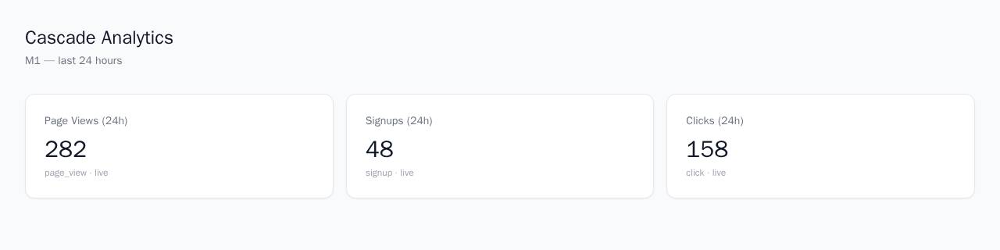

# Cascade

**A self-hostable, real-time product analytics platform** — the PostHog/Amplitude alternative you can run on your own infrastructure.

Events flow in through a tiny JS SDK, get buffered in Redis, land in ClickHouse within milliseconds, and surface on live dashboards. Everything in this repo — ingestion, storage, query, auth, dashboard — runs from one `docker compose up`.



_Three widgets, three live ClickHouse queries, ~300 seeded events flowing through the real pipeline — not mock data._

---

## Why this exists

Most analytics platforms ask you to ship your product data to someone else's cloud. Cascade is the alternative: a columnar store you own (ClickHouse), a queue you control (Redis Streams), and services small enough to read in an afternoon. The goal was never to out-feature PostHog — it was to prove that the _hard parts_ (multi-tenant event ingestion, sub-second query latency, collaborative dashboards) are tractable with a small, well-chosen stack.

## Architecture

```
                    ┌─────────────┐
   Browser / SDK ──▶│   ingest    │──▶ Redis Stream ──▶│  writer   │──▶ ClickHouse
   (capture/batch)   │  (Go, chi)  │   (ingest:stream)  │   (Go)    │   (events table)
                    └─────────────┘                    └───────────┘        │
                                                                              │
                    ┌─────────────┐                                         │
   Dashboard ───────│    query    │◀────────────────────────────────────────┘
   (React)          │ (Go, chi)   │──▶ Redis (result cache, 30s TTL)
                    └─────────────┘

                    ┌─────────────┐
   Register/Login ──│    auth     │──▶ Postgres (orgs, users, memberships)
                    │ (Node/      │──▶ signed JWT
                    │  Fastify)   │
                    └─────────────┘
```

**Why this shape:**

- **Redis Streams, not Kafka.** One fewer moving part to operate. Redis was already required for the query cache, so the ingestion buffer reuses it. Streams give consumer groups and at-least-once delivery — enough for v1. Kafka is the documented upgrade path if throughput ever demands it ([`DECISIONS.md`](DECISIONS.md)).
- **Go for the hot path, Node for the rest.** Ingest and query sit on the request path of every event and every dashboard refresh — Go's goroutines and low-overhead HTTP server matter there. Auth, the dashboard's future CRUD API, and realtime fan-out are I/O-bound and benefit more from Node's ecosystem (Fastify, JWT libraries, WebSocket tooling) than from raw throughput.
- **ClickHouse, not Postgres, for events.** Columnar storage with `MergeTree` + a materialized view (`events_counts_1m`) means count and time-series queries stay fast as event volume grows, without hand-rolled rollup tables.
- **At-least-once delivery, not exactly-once.** The writer only `XACK`s a Redis Stream message after the ClickHouse write succeeds. A crash mid-batch means re-delivery, not data loss. Exactly-once would need idempotency keys end-to-end for marginal benefit at this scale.

## What's actually working right now

This isn't a sketch — every box in the diagram above is a real running container, and the pipeline has been exercised end-to-end with seeded data and an automated smoke test.

| Layer                              | Status                                                                                |
| ---------------------------------- | ------------------------------------------------------------------------------------- |
| JS SDK → ingest API → Redis Stream | ✅ batches and single captures, UUIDv7 event IDs                                      |
| Writer: Redis Stream → ClickHouse  | ✅ batched async-insert, at-least-once, auto-recovers from a deleted consumer group   |
| Query API: count + time-series     | ✅ tenant-scoped, Redis-cached (30s TTL, `X-Cache: HIT` header)                       |
| Dashboard                          | ✅ React + Tailwind, live widgets pulling real counts                                 |
| Auth                               | ✅ register/login, bcrypt, JWT issuance, Postgres-backed orgs/users/memberships       |
| CI                                 | ✅ GitHub Actions: Go build+test matrix, TS typecheck+build, Docker build, smoke test |

What's _not_ built yet — funnels, realtime WebSocket push, dashboard CRUD persistence, JWT enforcement on ingest/query — is intentionally deferred and tracked in [`briefs/`](briefs/), one file per subsystem owner.

## Quick start

```bash
git clone <this-repo> && cd cascade
make up        # docker compose up --build — all 8 services + ClickHouse/Postgres/Redis
make smoke     # end-to-end pipeline proof: capture → queue → ClickHouse → query
```

Then open `http://localhost:3000` for the dashboard, or seed some realistic demo data first:

```bash
python3 -c "
import json, urllib.request, datetime, random
events = [{'event': random.choice(['page_view','click','signup']),
           'timestamp': (datetime.datetime.now(datetime.timezone.utc) - datetime.timedelta(hours=random.uniform(0,23))).strftime('%Y-%m-%dT%H:%M:%S.000Z'),
           'distinct_id': f'user-{random.randint(1,80)}'} for _ in range(300)]
req = urllib.request.Request('http://localhost:8080/v1/batch', data=json.dumps({'events': events}).encode(),
    headers={'Content-Type':'application/json','X-Tenant-ID':'00000000-0000-0000-0000-000000000001'}, method='POST')
print(urllib.request.urlopen(req).read().decode())
"
```

| Service         | URL                   |
| --------------- | --------------------- |
| Dashboard       | http://localhost:3000 |
| Ingest API      | http://localhost:8080 |
| Query API       | http://localhost:8081 |
| Auth API        | http://localhost:8083 |
| ClickHouse HTTP | http://localhost:8123 |

Full command reference: [`briefs/OPERATING-GUIDE.md`](briefs/OPERATING-GUIDE.md).

## The build process — and what actually broke

This was built as a "Foundation & Bootstrap" session: scaffold the monorepo, freeze the contracts (event schema, ClickHouse DDL, OpenAPI stubs), build one real end-to-end slice, prove it with a smoke test, then hand off per-subsystem briefs for parallel agent work. The honest version of that story includes everything that didn't work on the first try — most bugs here are the kind that only show up when you actually run the system end-to-end, not when you read the code.

### The ClickHouse parameter binding that looked right and wasn't

The query service binds time ranges as named parameters: `{from:DateTime64}`. Clean, typed, exactly what the docs show. It failed with:

```
code: 457, message: Value toDateTime('2026-06-16 01:04:47') cannot be parsed
as DateTime64 for query parameter 'from'
```

`clickhouse-go/v2` serializes a Go `time.Time` as the _string_ `toDateTime('...')` regardless of the declared parameter type — and ClickHouse's named-parameter substitution treats that as a literal value to parse, not a function call to evaluate. Switching the type hint to `DateTime` produced the same failure with a different message. The fix that actually held up: bind the time as a plain `Int64` Unix timestamp and cast explicitly in SQL —

```go
clickhouse.Named("from", from.Unix())
// SQL: timestamp >= toDateTime64({from:Int64}, 3, 'UTC')
```

No ambiguity left for the driver to get creative with.

### The writer that crashed itself into a corner

The writer consumes a Redis Stream via a consumer group. Mid-debugging, I deleted the stream to reset state for a clean test run — and `DEL` on a stream silently deletes its consumer group too. The writer's next `XREADGROUP` came back `NOGROUP` and the process exited. It had a startup-time `EnsureGroup()` call, but nothing protected the steady-state read loop from the group disappearing later. Fixed by catching `NOGROUP` mid-loop and re-creating the group instead of dying — the kind of resilience that only matters once you've broken it yourself.

### The smoke test that raced its own clock

`FROM`/`TO` were captured at the top of the script; the event timestamp `TS` was captured several lines later, after a health check and a baseline query. On a slow run, events ended up timestamped _after_ the query window's `TO` — invisible to the very count query meant to find them. The fix: capture one `NOW_EPOCH` and derive `FROM` (−1h), `TO` (+5min buffer), and `TS` from that single value, so events can never land outside the window regardless of how long the script takes to reach the batch-send step.

### The dashboard that rendered nothing — three different bugs deep

Getting the dashboard to actually show real numbers (not just "the container is healthy") surfaced a chain of issues that only appear when you click through as a user:

1. **nginx listened on the wrong port.** `docker-compose.yml` mapped host `3000` → container `3000`, but the stock `nginx:1.27-alpine` image listens on `80` by default — nobody overrode it. Docker's port forwarding to a port nothing is bound to surfaced as a silent `Recv failure: Connection reset by peer`, not the more obvious "connection refused." Fixed with a custom `nginx.conf` that actually listens on 3000, plus a real healthcheck (there wasn't one before).
2. **Vite env vars were set at the wrong layer.** `VITE_QUERY_URL` was passed as a container `environment:` variable — but Vite inlines `import.meta.env.VITE_*` at _build time_, and a static SPA served by nginx never reads runtime env vars. The bundled JS always had `undefined`, silently fell back to a relative `/api/query` path, which nginx's SPA fallback resolved to `index.html`. The widgets were trying to `JSON.parse()` an HTML document. Fixed by passing the same values as Docker build `args` instead.
3. **No CORS headers.** Once the dashboard was actually calling the real query API from `localhost:3000` to `localhost:8081`, the browser blocked it outright — no `Access-Control-Allow-Origin` header existed on a cross-origin API that was never designed to be called from a browser context directly. Added permissive CORS middleware to both Go services (tightened to an allowlist once JWT auth lands).

None of these would show up in a unit test or even a curl-based health check. They only surface when you load the actual page in an actual browser and watch what happens — which is exactly why this session ended with a Playwright screenshot, not just a green smoke test.

### Docker Desktop fell over mid-session

At one point the Docker daemon itself disconnected (`/usr/bin/docker: Input/output error` → `dial unix /var/run/docker.sock: connect: no such file or directory`), wiping all running containers. This is WSL2 + Docker Desktop being WSL2 + Docker Desktop, not a bug in Cascade — but it's a useful reminder that ClickHouse and Postgres data lived in named volumes, so `docker compose up -d` afterward brought every container back with all seeded data intact. The Redis Stream consumer group did not survive (see above), which is exactly the failure mode the `NOGROUP` retry fix now handles automatically.

## Repository layout

```
cascade/
├── apps/dashboard/        React + Vite + Tailwind + Recharts
├── services/
│   ├── ingest/             Go — HTTP capture API → Redis Stream
│   ├── writer/             Go — Redis Stream → ClickHouse batch writer
│   ├── query/               Go — ClickHouse read API + Redis result cache
│   └── auth/                 Node/Fastify — register/login, JWT, Postgres
├── packages/
│   ├── types/              Canonical TypeScript event/API types
│   └── sdk/                  Browser SDK (capture, batch, auto-flush)
├── infra/
│   ├── docker-compose.yml
│   ├── clickhouse/          server config + user profile (async_insert tuning)
│   └── migrations/          ClickHouse DDL + Postgres schema, applied at first boot
├── briefs/                 Per-subsystem handoff docs (read yours before starting)
├── scripts/smoke-test.sh   End-to-end pipeline proof
├── CLAUDE.md                Conventions every session should read first
└── DECISIONS.md             Architecture decision log
```

## What's next

The [`briefs/`](briefs/) directory has a per-owner breakdown of what's left — funnels and property filters for query, dashboard CRUD persistence and a real `app-api` service, WebSocket realtime push, JWT enforcement replacing the current `X-Tenant-ID` header trust, and CI/observability hardening. [`briefs/OPERATING-GUIDE.md`](briefs/OPERATING-GUIDE.md) has the full command reference and a troubleshooting section built directly from the bugs above.
